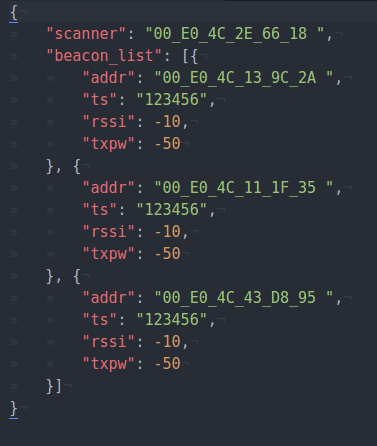
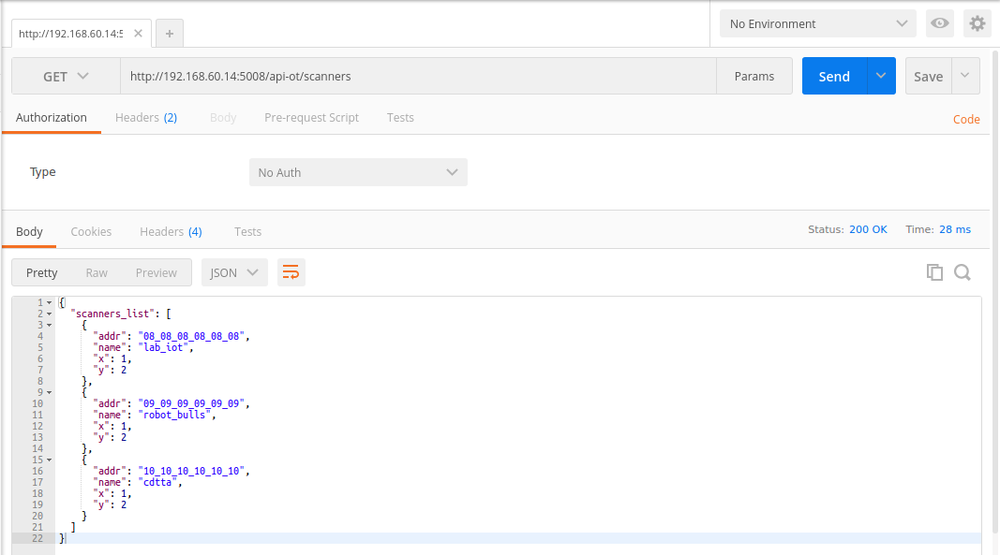
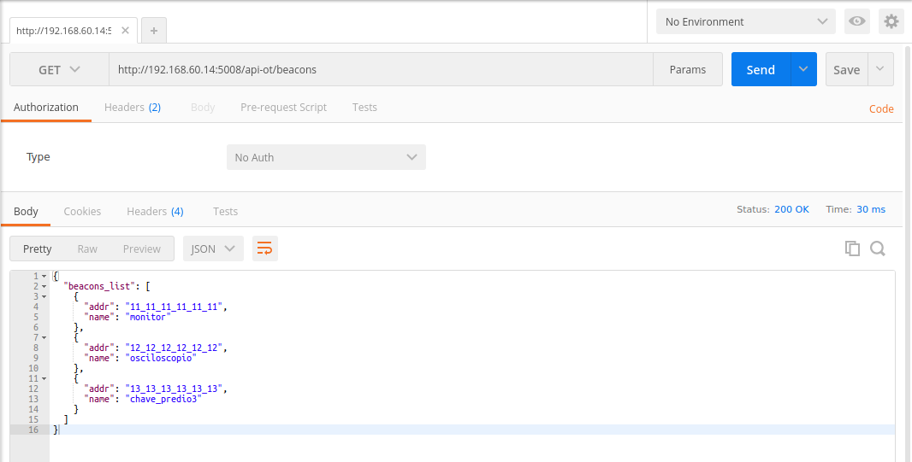
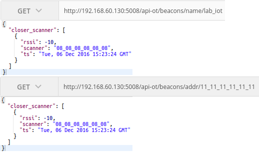
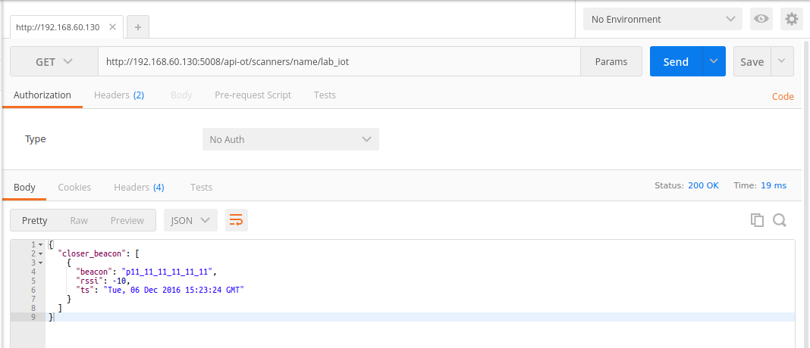

# **Documentação LabIOT Inatel- Software**

## Para instalar pacotes para o python será necessário a instalação do pip:

``` sudo apt-get install -y python-pip```

## Atualize o pip:

``` sudo pip install --upgrade pip```


## Para instalação do mongoDB no Ubuntu 16.04, dê os seguintes comandos:

- ``` sudo apt-key adv --keyserver hkp://keyserver.ubuntu.com:80 --recv EA312927```

- ``` echo "deb http://repo.mongodb.org/apt/ubuntu xenial/mongodb-org/3.2 multiverse" | sudo tee /etc/apt/sources.list.d/mongodb-org-3.2.list```

- ``` sudo apt-get update```

- ``` sudo apt-get install -y mongodb-org```

- #### Em seguida crie o arquivo de configuração:
- > ```sudo gedit /etc/systemd/system/mongodb.service```

- #### Copie o seguinte conteúdo para o arquivo, salve e feche.

- > [Unit]  
    Description=High-performance, schema-free document-oriented database
    After=network.target
    [Service]  
    User=mongodb
    ExecStart=/usr/bin/mongod --quiet --config /etc/mongod.conf  
    [Install]  
    WantedBy=multi-user.target

- #### Inicialize o serviço:
- ``` sudo systemctl start mongodb```
- #### Ativa inicialização automática do serviço:
- ```sudo systemctl enable mongodb```


## Instalação dos módulos Python necessários :
- ```	sudo pip install  Flask```
- ```	sudo pip install  pymongo```
- ```	sudo pip install  pprint```
- ```	sudo pip install -U flask-cors```


# **Rotas Flask/ Api- Of Things:**
 ## **POST:**
 - #### Posta documento JSON com beacons lidos por um scanner:
 - ### URL = http://ipServer:porta/api-ot/beacons
 


 ## **GET:**
- #### Lista todos scanners:
- ### URL =	http://ipServer:porta/api-ot/scanners


#### Lista todos beacons:
- ### URL =	http://ipServer:porta/api-ot/beacons


## **Buscas:**
Retorna scanner mais próximo ao beacon, em que o addr ou nome do beacon foi passado por parametro.
- ### URL = http://ipServer:porta/api-ot/beacons/addr/”addr”
- ### URL = http://ipServer:porta/api-ot/beacons/name/”nome”


Retorna beacon mais próximo ao scanner, em que o addr ou nome do scanner foi passado por parametro.
- ### URL = http://ipServer:porta/api-ot/scanners/addr/”addr”

- ### URL = http://ipServer:porta/api-ot/scanners/name/”name”

